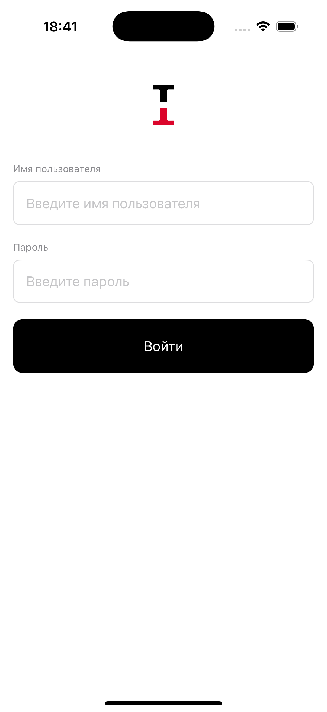
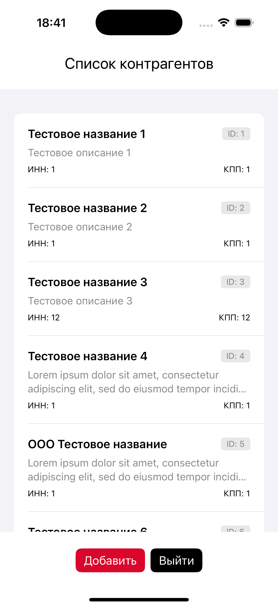
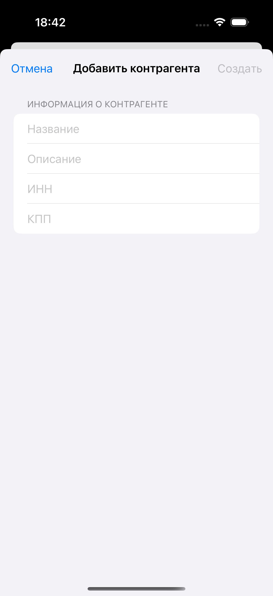
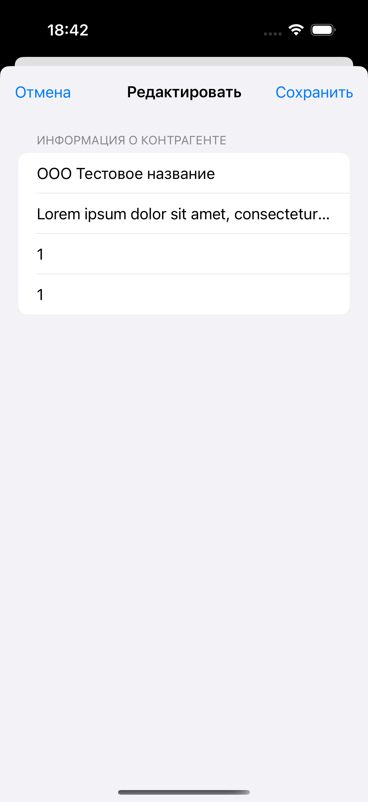
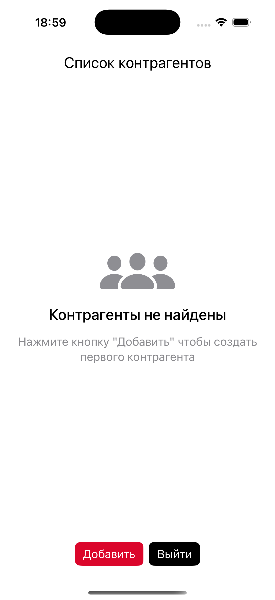
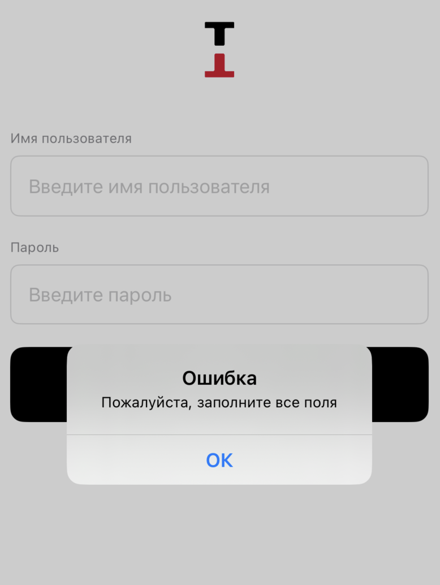
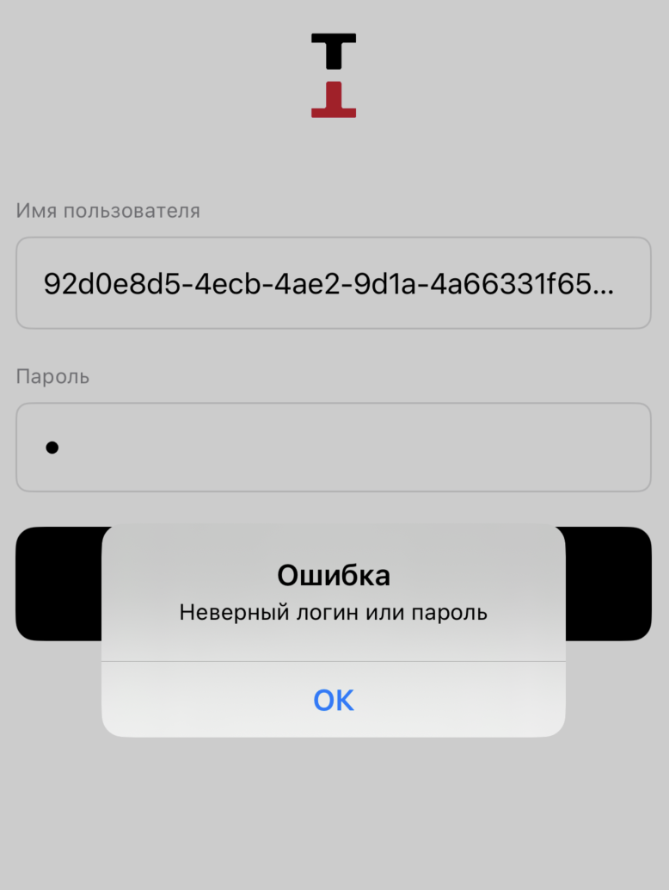
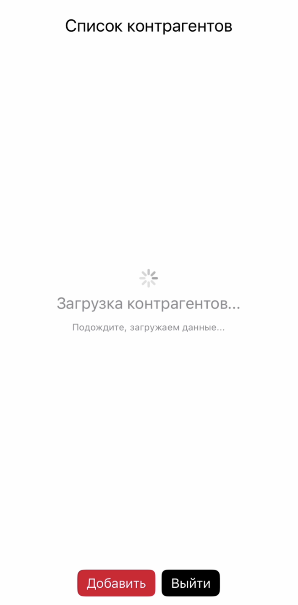
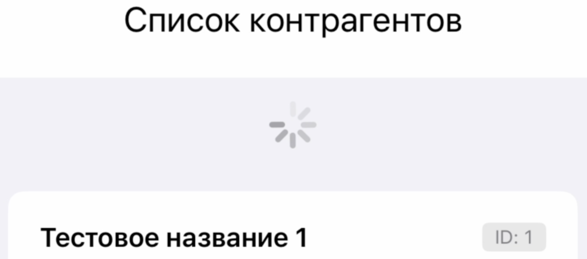

# NGBR

## Описание проекта

Мобильное приложение для управления контрагентами с JWT-аутентификацией, написанное на SwiftUI. Реализован функционал авторизации, просмотра списка контрагентов, их добавления, редактирования и удаления.

---

## Сцены

<div align="center">
  
  
  
  
    
</div>

---

## Элементы интерфейса

<div align="center">

<table>
  <tr>
    <td align="center">
      <br>
      <b>Error Alert</b>
    </td>
    <td align="center">
      <br>
      <b>Error Alert</b>
    </td>
  </tr>
  <tr>
    <td align="center">
      <br>
      <b>Spinner</b>
    </td>
    <td align="center">
      <br>
      <b>Refresh</b>
    </td>
  </tr>
</table>

</div>

---

## Структура

### **Архитектура: MVVM**
- **Model** - модели данных (`ContractorModel`, `AuthModel`, `AuthToken`)
- **View** - SwiftUI представления (`AuthView`, `ContractorView`, `ContractorDetailView`)
- **ViewModel** - бизнес-логика (`AuthViewModel`, `ContractorViewModel`, `ContractorDetailViewModel`)
- **Repository** - слой доступа к данным (`AuthRepository`, `ContractorRepository`)
- **Service** - сервисы (`APIClient`, `TokenManager`, `KeychainService`)

### **Навигация**
- **AppStateManager** - регулирует смену экранов:
- Автоматический переход между экранами на основе статуса аутентификации
- Модальные окна для добавления/редактирования контрагентов

### **Сетевой слой**
- **APIClient** - клиент на основе URLSession
- **JWT токены** - управление автоматическое
- **Обработка ошибок** - реализована обработка 401/403 ошибок

### **Управление состоянием**
- **@StateObject** и **@ObservedObject** - реактивное управление состоянием
- **@Published** - автоматическое обновление UI
- **Factory Pattern** - управление зависимостями

### **Локальное хранение**
- **Keychain** - безопасное хранение JWT токенов
- **Core Data** - локальная база данных, кэширование токенов
- **Offline режим** - работа с локальными данными при недоступности API

### **Обработка ошибок**
- **401** - автоматическое обновление токена и повтор запроса
- **403** - обновление токена в фоне с уведомлением о запрете доступа
- **Неверный логин или пароль** - информативные сообщения об ошибках через Alert

---

## Прочее

### **Требования**
- Xcode 15.0+
- iOS 16.0+
- Swift 5.9+

### **Установка**
1. Клонируйте репозиторий:
   ```bash
   git clone <repository-url>
   cd NGBRTest
   ```

2. Откройте проект в Xcode:
   ```bash
   open NGBRTest.xcodeproj
   ```

3. Выберите симулятор или подключенное устройство

4. Нажмите `Cmd + R` для запуска

---

## Заключение

**Ключевые достижения:**
- Реализация CRUD для контрагентов
- JWT аутентификация
- Офлайн режим с локальным кэшированием
- Чистая архитектура
- Обработка всех сценариев и ошибок API

